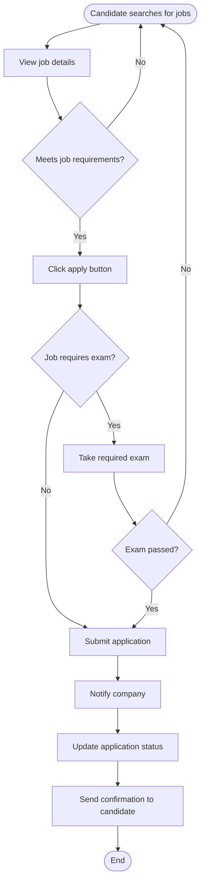
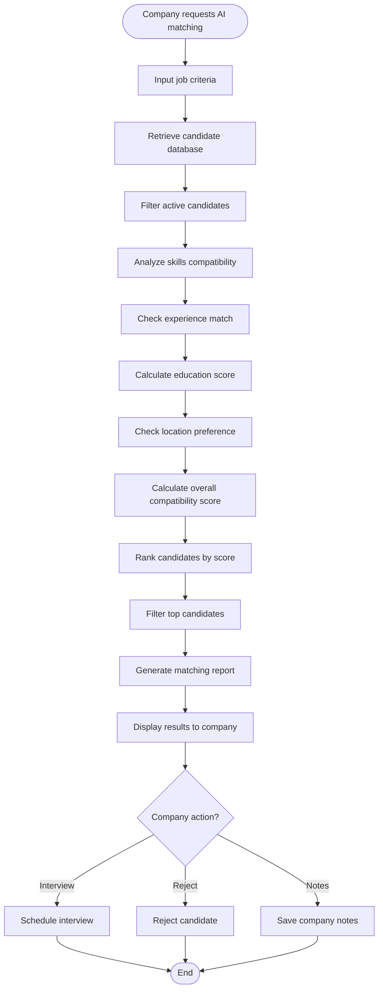
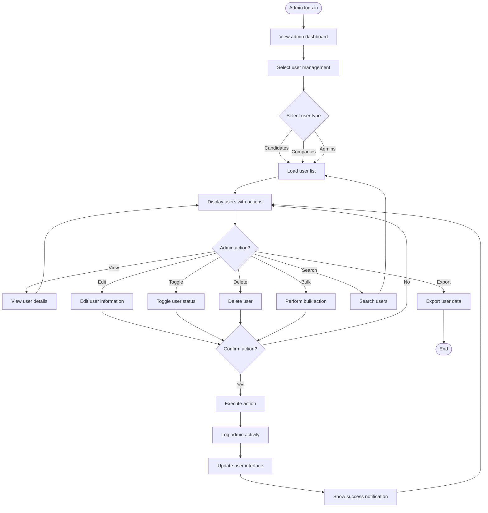
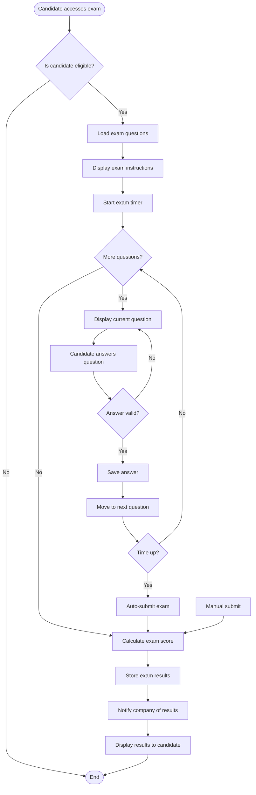
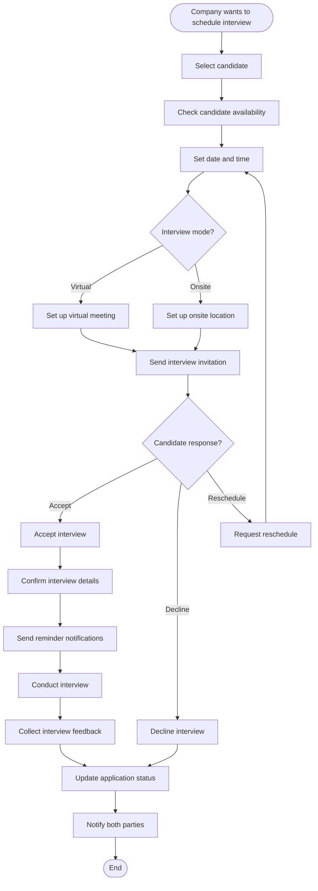
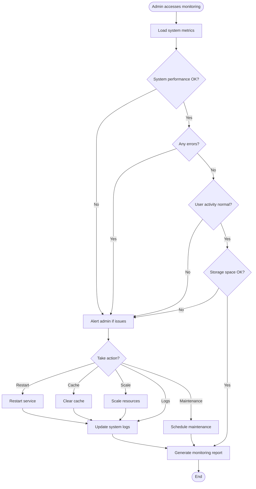
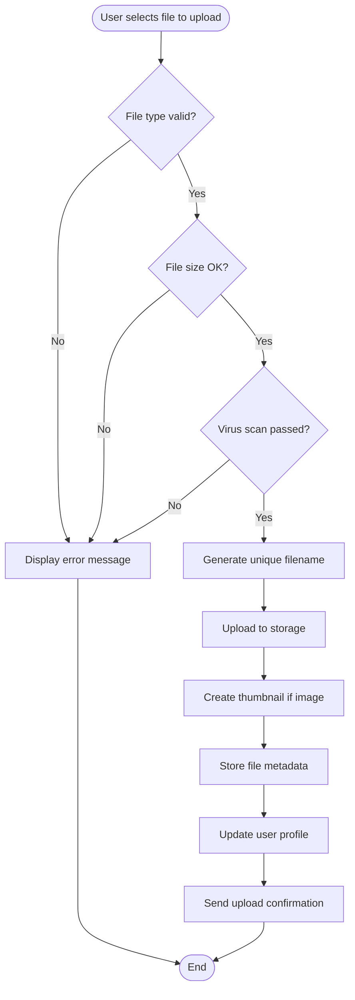

# Activity Diagram - CandiHire System

## Overview
Activity diagrams show the flow of activities and decision points in the CandiHire system processes.

## 1. User Registration Process

```mermaid
flowchart TD
    Start([User visits registration page])
    SelectType{Select user type}
    Candidate[Fill candidate form]
    Company[Fill company form]
    Admin[Admin registration<br/>(System only)]
    
    ValidateData{Validate form data}
    DataValid{Data valid?}
    ShowErrors[Display validation errors]
    CheckEmail{Email already exists?}
    CreateAccount[Create user account]
    HashPassword[Hash password]
    StoreData[Store in database]
    SendConfirmation[Send confirmation email]
    Success[Registration successful]
    End([End])
    
    Start --> SelectType
    SelectType -->|Candidate| Candidate
    SelectType -->|Company| Company
    SelectType -->|Admin| Admin
    
    Candidate --> ValidateData
    Company --> ValidateData
    Admin --> ValidateData
    
    ValidateData --> DataValid
    DataValid -->|No| ShowErrors
    ShowErrors --> Candidate
    ShowErrors --> Company
    ShowErrors --> Admin
    
    DataValid -->|Yes| CheckEmail
    CheckEmail -->|Yes| ShowErrors
    CheckEmail -->|No| CreateAccount
    CreateAccount --> HashPassword
    HashPassword --> StoreData
    StoreData --> SendConfirmation
    SendConfirmation --> Success
    Success --> End
```

## 2. Job Application Process



## 3. AI Matching Process



## 4. Admin User Management Process



## 5. Exam Taking Process



## 6. Interview Scheduling Process



## 7. System Monitoring Process (Admin)



## 8. File Upload Process



## Activity Descriptions

### Decision Points
- **User Type Selection**: Determines registration flow
- **Data Validation**: Ensures data integrity
- **Eligibility Checks**: Verifies user permissions
- **Time Constraints**: Manages exam timing
- **Response Handling**: Processes user choices

### Parallel Activities
- **File Processing**: Thumbnail generation and metadata storage
- **Notification Sending**: Email and system notifications
- **Logging**: Activity tracking and audit trails
- **Database Updates**: Multiple table updates

### Error Handling
- **Validation Errors**: Form validation failures
- **System Errors**: Database or service failures
- **Permission Errors**: Unauthorized access attempts
- **Timeout Errors**: Session or process timeouts

### Synchronization Points
- **Exam Submission**: Synchronizes timer and submission
- **Interview Confirmation**: Synchronizes both parties
- **Bulk Operations**: Synchronizes multiple user updates
- **System Maintenance**: Synchronizes all services
