# Context Diagram - CandiHire System

## Overview
The Context Diagram shows the CandiHire system as a single process and its interactions with external entities.

## Diagram Code (Mermaid)

```mermaid
graph TB
    %% External Entities
    Candidate[👤 Candidate<br/>Job Seeker]
    Company[🏢 Company<br/>Employer]
    Admin[👨‍💼 Administrator<br/>System Admin]
    EmailService[📧 Email Service<br/>SMTP Server]
    FileStorage[💾 File Storage<br/>Upload System]
    Database[🗄️ Database<br/>MySQL]
    PaymentGateway[💳 Payment Gateway<br/>Billing System]
    ExternalAPI[🌐 External APIs<br/>Job Boards, Skills Data]
    
    %% Main System
    CandiHire[🎯 CandiHire System<br/>AI-Powered Recruitment Platform]
    
    %% Connections
    Candidate -->|Register, Login, Apply for Jobs, Take Exams| CandiHire
    Company -->|Register, Post Jobs, Review Applications, Schedule Interviews| CandiHire
    Admin -->|Manage Users, Monitor System, Configure Settings| CandiHire
    
    CandiHire -->|Send Notifications, Interview Invites| EmailService
    CandiHire -->|Store CVs, Profile Pictures, Documents| FileStorage
    CandiHire -->|Store User Data, Job Posts, Exam Results| Database
    CandiHire -->|Process Payments, Subscriptions| PaymentGateway
    CandiHire -->|Fetch Job Data, Skills Trends| ExternalAPI
    
    %% Reverse flows
    EmailService -->|Delivery Status| CandiHire
    FileStorage -->|File URLs| CandiHire
    Database -->|Query Results| CandiHire
    PaymentGateway -->|Payment Status| CandiHire
    ExternalAPI -->|Data Response| CandiHire
```

## External Entities Description

### 1. Candidate (Job Seeker)
- **Role**: Individual looking for employment opportunities
- **Interactions**:
  - Register and create profile
  - Search and apply for jobs
  - Take online exams
  - Participate in interviews
  - Upload CV and documents
  - Receive notifications

### 2. Company (Employer)
- **Role**: Organization seeking to hire talent
- **Interactions**:
  - Register company profile
  - Post job openings
  - Review candidate applications
  - Schedule and conduct interviews
  - Use AI matching features
  - Manage recruitment process

### 3. Administrator
- **Role**: System administrator managing the platform
- **Interactions**:
  - Monitor system performance
  - Manage user accounts
  - Configure system settings
  - View activity logs
  - Handle support requests
  - Maintain system security

### 4. Email Service
- **Role**: External email delivery system
- **Interactions**:
  - Send notifications to users
  - Deliver interview invitations
  - Send password reset emails
  - Send system alerts

### 5. File Storage
- **Role**: External file storage system
- **Interactions**:
  - Store user uploaded files
  - Manage CV documents
  - Store profile pictures
  - Handle document processing

### 6. Database
- **Role**: Data persistence layer
- **Interactions**:
  - Store user information
  - Manage job postings
  - Store exam results
  - Handle application data
  - Maintain system logs

### 7. Payment Gateway
- **Role**: Financial transaction processor
- **Interactions**:
  - Process subscription payments
  - Handle premium features billing
  - Manage refunds
  - Generate invoices

### 8. External APIs
- **Role**: Third-party data sources
- **Interactions**:
  - Fetch job market data
  - Get trending skills information
  - Integrate with job boards
  - Provide industry insights

## Data Flows

### Input Flows (To System)
- User registration data
- Job posting information
- Application submissions
- Exam responses
- File uploads
- Payment information
- Admin commands

### Output Flows (From System)
- User notifications
- Search results
- Exam scores
- Interview schedules
- System reports
- File downloads
- Payment confirmations

## System Boundaries
The CandiHire system acts as the central hub that:
- Processes all user interactions
- Manages data flow between entities
- Provides AI-powered matching
- Handles authentication and authorization
- Manages the complete recruitment lifecycle
