# Data Flow Diagram (DFD) - CandiHire System

## Overview
The DFD shows how data flows through the CandiHire system, including processes, data stores, and external entities.

## Level 0 DFD (Context Level)

```mermaid
graph LR
    %% External Entities
    Candidate[👤 Candidate]
    Company[🏢 Company]
    Admin[👨‍💼 Admin]
    EmailService[📧 Email Service]
    FileStorage[💾 File Storage]
    
    %% Main System
    CandiHire[🎯 CandiHire System]
    
    %% Data Flows
    Candidate -->|User Data, Job Applications| CandiHire
    Company -->|Job Posts, Interview Requests| CandiHire
    Admin -->|Management Commands| CandiHire
    
    CandiHire -->|Notifications| EmailService
    CandiHire -->|Files| FileStorage
    CandiHire -->|User Data| Candidate
    CandiHire -->|Job Data| Company
    CandiHire -->|System Reports| Admin
```

## Level 1 DFD (Main Processes)

```mermaid
graph TB
    %% External Entities
    Candidate[👤 Candidate]
    Company[🏢 Company]
    Admin[👨‍💼 Admin]
    EmailService[📧 Email Service]
    FileStorage[💾 File Storage]
    
    %% Main Processes
    P1[1.0<br/>User Authentication<br/>& Registration]
    P2[2.0<br/>Profile Management]
    P3[3.0<br/>Job Management]
    P4[4.0<br/>Application Processing]
    P5[5.0<br/>Exam System]
    P6[6.0<br/>Interview Management]
    P7[7.0<br/>AI Matching]
    P8[8.0<br/>Admin Management]
    P9[9.0<br/>Notification System]
    
    %% Data Stores
    D1[(D1: User Database)]
    D2[(D2: Job Database)]
    D3[(D3: Application Database)]
    D4[(D4: Exam Database)]
    D5[(D5: Interview Database)]
    D6[(D6: File Database)]
    D7[(D7: System Logs)]
    D8[(D8: Settings Database)]
    
    %% External to Process Flows
    Candidate -->|Login Credentials| P1
    Company -->|Registration Data| P1
    Admin -->|Admin Credentials| P1
    
    Candidate -->|Profile Updates| P2
    Company -->|Company Profile| P2
    
    Company -->|Job Posting| P3
    Candidate -->|Job Search| P3
    
    Candidate -->|Job Application| P4
    Company -->|Application Review| P4
    
    Candidate -->|Exam Request| P5
    Company -->|Exam Creation| P5
    
    Company -->|Interview Schedule| P6
    Candidate -->|Interview Response| P6
    
    Company -->|Matching Request| P7
    
    Admin -->|Management Commands| P8
    
    %% Process to External Flows
    P1 -->|User Data| Candidate
    P1 -->|Company Data| Company
    P1 -->|Admin Access| Admin
    
    P2 -->|Updated Profile| Candidate
    P2 -->|Updated Company| Company
    
    P3 -->|Job Listings| Candidate
    P3 -->|Job Management| Company
    
    P4 -->|Application Status| Candidate
    P4 -->|Application List| Company
    
    P5 -->|Exam Interface| Candidate
    P5 -->|Exam Results| Company
    
    P6 -->|Interview Invites| Candidate
    P6 -->|Interview Schedule| Company
    
    P7 -->|Matching Results| Company
    
    P8 -->|System Reports| Admin
    
    P9 -->|Notifications| EmailService
    P9 -->|File URLs| FileStorage
    
    %% Process to Data Store Flows
    P1 <-->|User Data| D1
    P2 <-->|Profile Data| D1
    P3 <-->|Job Data| D2
    P4 <-->|Application Data| D3
    P5 <-->|Exam Data| D4
    P6 <-->|Interview Data| D5
    P2 <-->|File References| D6
    P8 <-->|System Data| D7
    P8 <-->|Configuration| D8
    
    %% Data Store to Process Flows
    D1 -->|User Info| P4
    D1 -->|User Info| P5
    D1 -->|User Info| P6
    D1 -->|User Info| P7
    D1 -->|User Info| P8
    
    D2 -->|Job Info| P4
    D2 -->|Job Info| P7
    
    D3 -->|Application Info| P4
    D3 -->|Application Info| P6
    
    D4 -->|Exam Info| P5
    
    D5 -->|Interview Info| P6
    
    D6 -->|File Info| P2
    D6 -->|File Info| P9
    
    D7 -->|Log Data| P8
    
    D8 -->|Settings| P8
    D8 -->|Settings| P9
```

## Level 2 DFD - User Authentication Process (1.0)

```mermaid
graph TB
    %% External Entities
    Candidate[👤 Candidate]
    Company[🏢 Company]
    Admin[👨‍💼 Admin]
    
    %% Sub-processes
    P1_1[1.1<br/>Validate Credentials]
    P1_2[1.2<br/>Create Session]
    P1_3[1.3<br/>Register New User]
    P1_4[1.4<br/>Send Confirmation]
    
    %% Data Stores
    D1[(D1: User Database)]
    D7[(D7: Session Store)]
    
    %% Flows
    Candidate -->|Login Data| P1_1
    Company -->|Login Data| P1_1
    Admin -->|Admin Login| P1_1
    
    P1_1 -->|Valid Credentials| P1_2
    P1_1 -->|New User| P1_3
    
    P1_2 -->|Session Data| D7
    P1_2 -->|User Access| Candidate
    P1_2 -->|User Access| Company
    P1_2 -->|Admin Access| Admin
    
    P1_3 -->|User Data| D1
    P1_3 -->|Registration| P1_4
    
    P1_4 -->|Confirmation| EmailService
    
    D1 -->|User Validation| P1_1
```

## Level 2 DFD - Admin Management Process (8.0)

```mermaid
graph TB
    %% External Entity
    Admin[👨‍💼 Admin]
    
    %% Sub-processes
    P8_1[8.1<br/>User Management]
    P8_2[8.2<br/>System Monitoring]
    P8_3[8.3<br/>Settings Management]
    P8_4[8.4<br/>Report Generation]
    P8_5[8.5<br/>Activity Logging]
    
    %% Data Stores
    D1[(D1: User Database)]
    D2[(D2: Job Database)]
    D3[(D3: Application Database)]
    D7[(D7: System Logs)]
    D8[(D8: Settings Database)]
    
    %% Flows
    Admin -->|Management Commands| P8_1
    Admin -->|Monitoring Requests| P8_2
    Admin -->|Settings Changes| P8_3
    Admin -->|Report Requests| P8_4
    
    P8_1 -->|User Operations| D1
    P8_1 -->|User Data| Admin
    
    P8_2 -->|System Data| D1
    P8_2 -->|System Data| D2
    P8_2 -->|System Data| D3
    P8_2 -->|Statistics| Admin
    
    P8_3 -->|Settings Updates| D8
    P8_3 -->|Settings Data| Admin
    
    P8_4 -->|Report Data| D1
    P8_4 -->|Report Data| D2
    P8_4 -->|Report Data| D3
    P8_4 -->|Reports| Admin
    
    P8_5 -->|Activity Data| D7
    P8_1 -->|Activity Data| P8_5
    P8_2 -->|Activity Data| P8_5
    P8_3 -->|Activity Data| P8_5
    P8_4 -->|Activity Data| P8_5
```

## Data Store Descriptions

### D1: User Database
- **Contents**: User profiles, authentication data, preferences
- **Key Entities**: Candidates, Companies, Admins
- **Access**: Read/Write by all processes

### D2: Job Database
- **Contents**: Job postings, requirements, status
- **Key Entities**: Jobs, JobCategories, JobRequirements
- **Access**: Read/Write by Job Management, Read by Application Processing

### D3: Application Database
- **Contents**: Job applications, status, notes
- **Key Entities**: Applications, ApplicationStatus, ApplicationNotes
- **Access**: Read/Write by Application Processing

### D4: Exam Database
- **Contents**: Questions, answers, results, assignments
- **Key Entities**: Exams, Questions, Results, Assignments
- **Access**: Read/Write by Exam System

### D5: Interview Database
- **Contents**: Interview schedules, feedback, outcomes
- **Key Entities**: Interviews, Schedules, Feedback
- **Access**: Read/Write by Interview Management

### D6: File Database
- **Contents**: File metadata, storage references
- **Key Entities**: Files, FileTypes, StoragePaths
- **Access**: Read/Write by Profile Management

### D7: System Logs
- **Contents**: Activity logs, error logs, audit trails
- **Key Entities**: Logs, Activities, Errors
- **Access**: Write by all processes, Read by Admin Management

### D8: Settings Database
- **Contents**: System configuration, feature flags
- **Key Entities**: Settings, Configurations, Features
- **Access**: Read by all processes, Write by Admin Management

## Data Flow Descriptions

### Input Flows
1. **User Registration Data**: Personal information, credentials, preferences
2. **Job Posting Data**: Job details, requirements, company information
3. **Application Data**: Job application submissions, cover letters
4. **Exam Data**: Questions, answers, time limits
5. **Interview Data**: Schedule requests, feedback, outcomes
6. **Admin Commands**: Management operations, configuration changes

### Output Flows
1. **User Notifications**: Email alerts, system messages
2. **Search Results**: Job listings, candidate profiles
3. **Reports**: System statistics, user analytics
4. **File Downloads**: CVs, documents, certificates
5. **System Status**: Health checks, performance metrics

### Internal Flows
1. **Authentication Data**: Session tokens, user permissions
2. **Matching Data**: AI algorithm results, compatibility scores
3. **Processing Data**: Intermediate calculations, temporary storage
4. **Log Data**: Activity records, error tracking

## Process Descriptions

### 1.0 User Authentication & Registration
- **Purpose**: Manage user access and account creation
- **Inputs**: Login credentials, registration data
- **Outputs**: Session data, user access, confirmations
- **Processes**: Validate credentials, create sessions, register users

### 2.0 Profile Management
- **Purpose**: Handle user profile updates and file uploads
- **Inputs**: Profile updates, file uploads
- **Outputs**: Updated profiles, file references
- **Processes**: Validate data, store files, update profiles

### 3.0 Job Management
- **Purpose**: Manage job postings and search functionality
- **Inputs**: Job postings, search criteria
- **Outputs**: Job listings, search results
- **Processes**: Create jobs, search database, filter results

### 4.0 Application Processing
- **Purpose**: Handle job applications and reviews
- **Inputs**: Applications, review decisions
- **Outputs**: Application status, notifications
- **Processes**: Process applications, update status, notify users

### 5.0 Exam System
- **Purpose**: Manage online assessments and scoring
- **Inputs**: Exam requests, answers
- **Outputs**: Exam interfaces, results
- **Processes**: Generate exams, score answers, store results

### 6.0 Interview Management
- **Purpose**: Schedule and manage interviews
- **Inputs**: Schedule requests, feedback
- **Outputs**: Interview schedules, notifications
- **Processes**: Schedule interviews, send invites, collect feedback

### 7.0 AI Matching
- **Purpose**: Match candidates to jobs using AI
- **Inputs**: Job requirements, candidate profiles
- **Outputs**: Matching scores, ranked lists
- **Processes**: Analyze profiles, calculate compatibility, rank results

### 8.0 Admin Management
- **Purpose**: System administration and monitoring
- **Inputs**: Admin commands, monitoring requests
- **Outputs**: System reports, configuration changes
- **Processes**: Manage users, monitor system, configure settings

### 9.0 Notification System
- **Purpose**: Send automated notifications
- **Inputs**: Notification triggers, user data
- **Outputs**: Email notifications, system alerts
- **Processes**: Generate messages, send emails, track delivery
