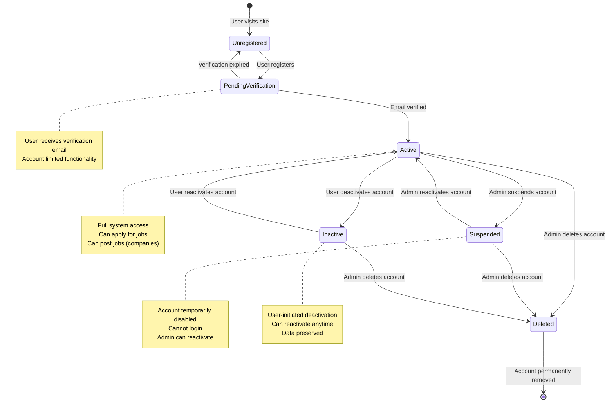
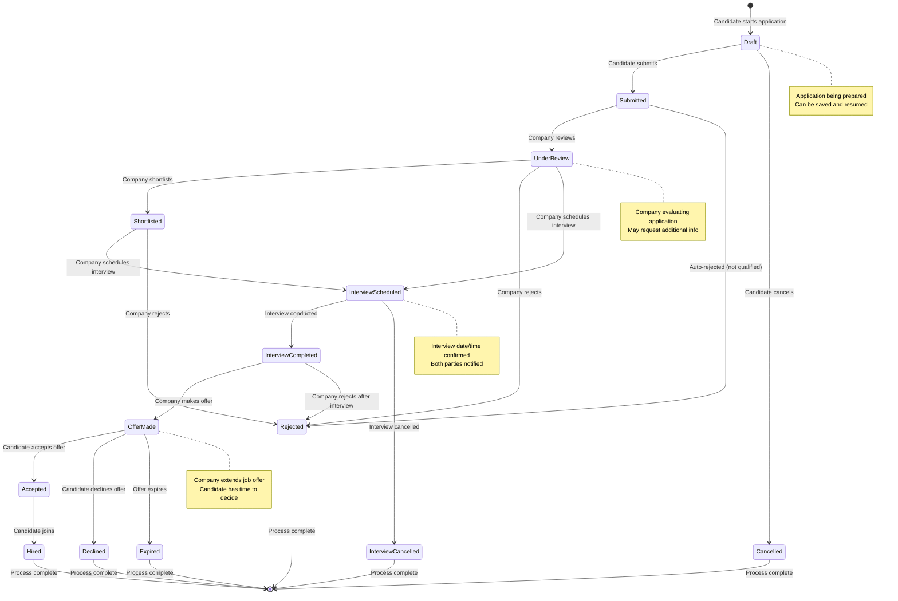
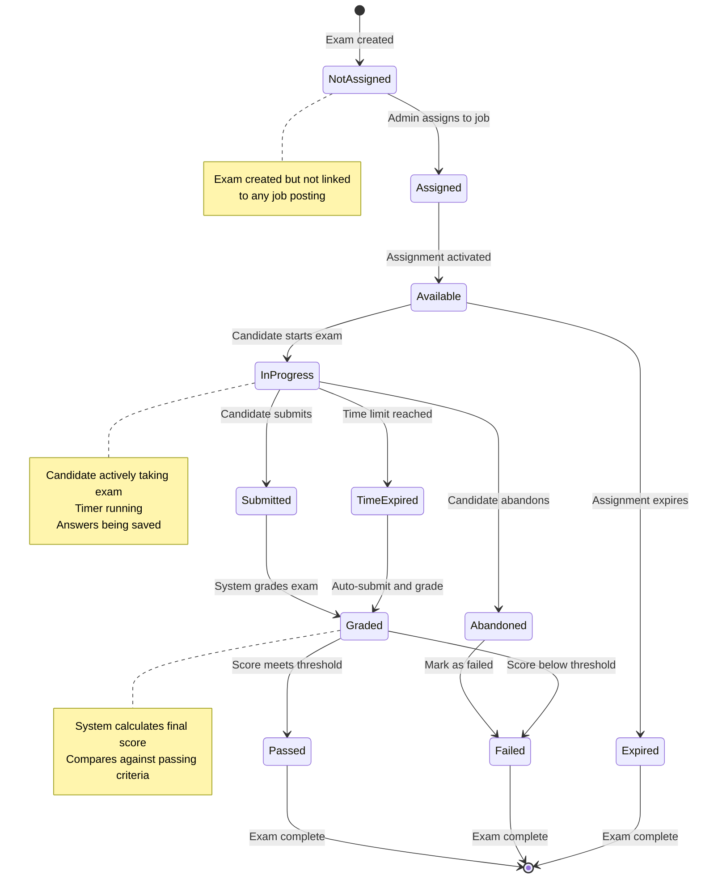
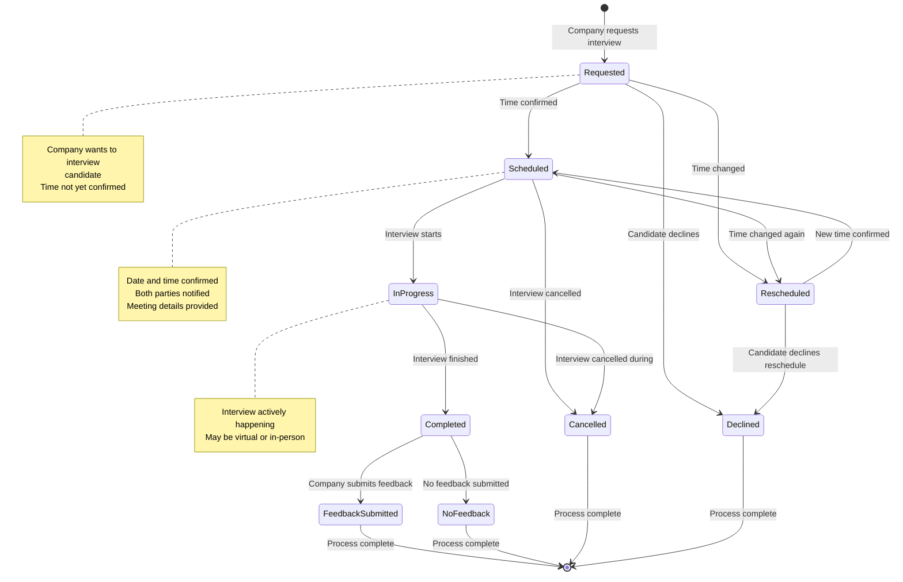
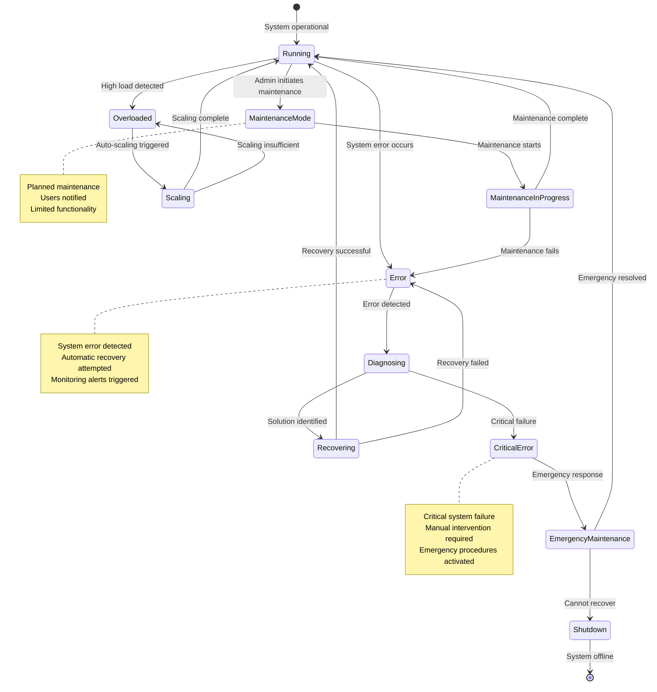
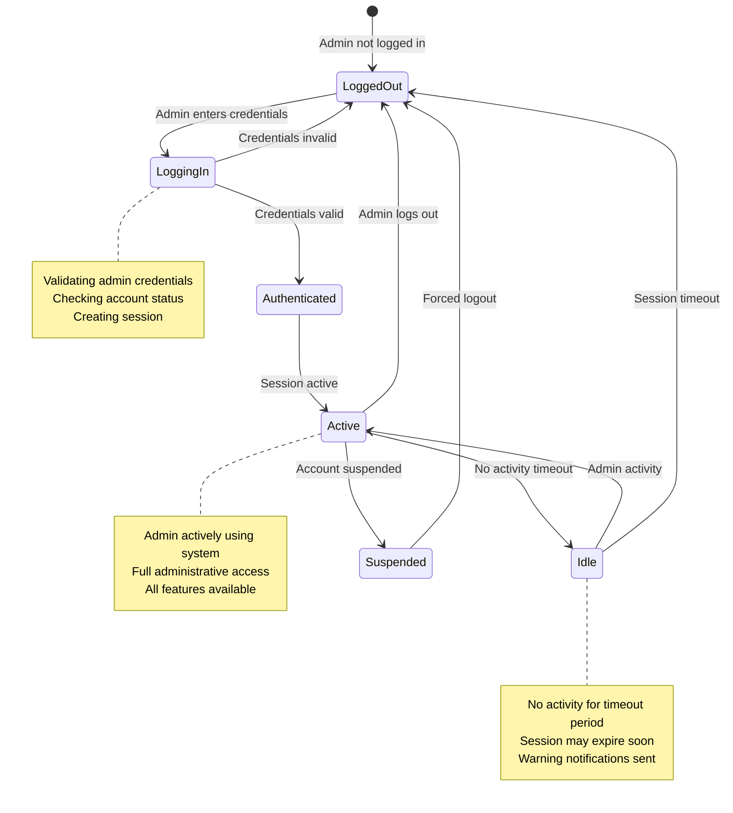
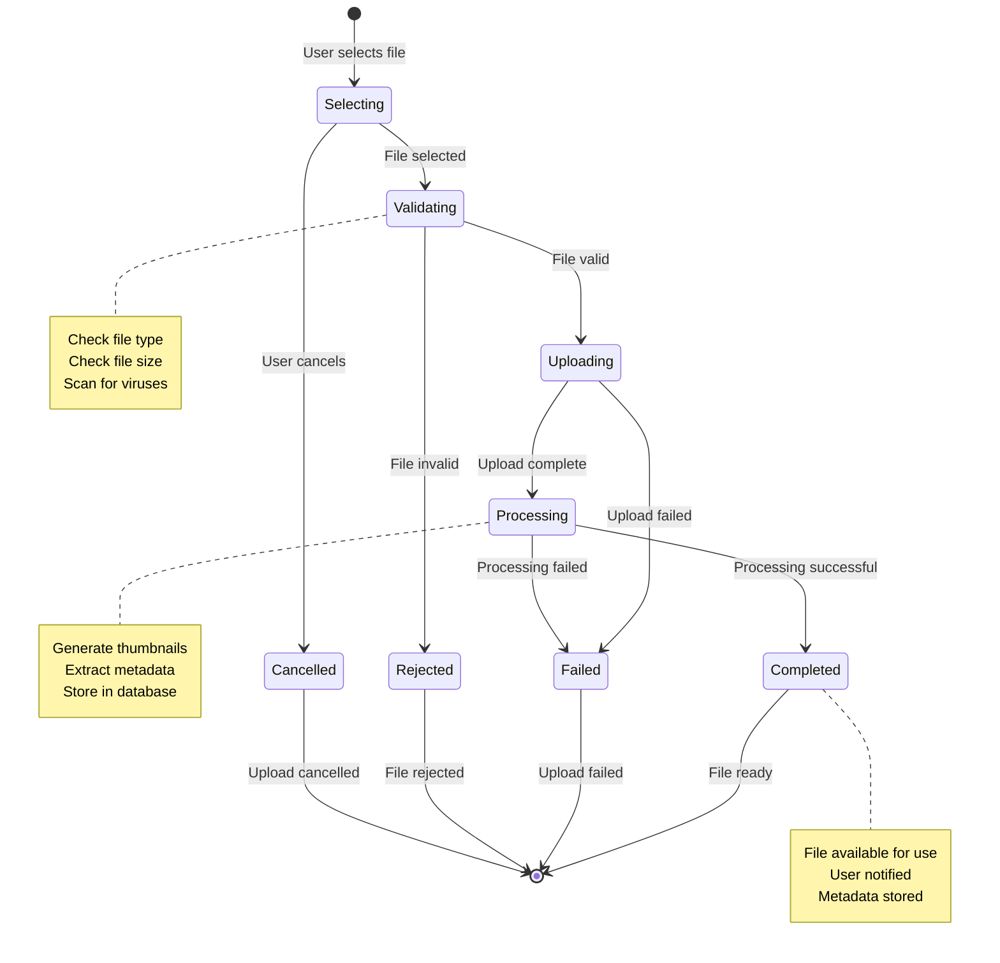
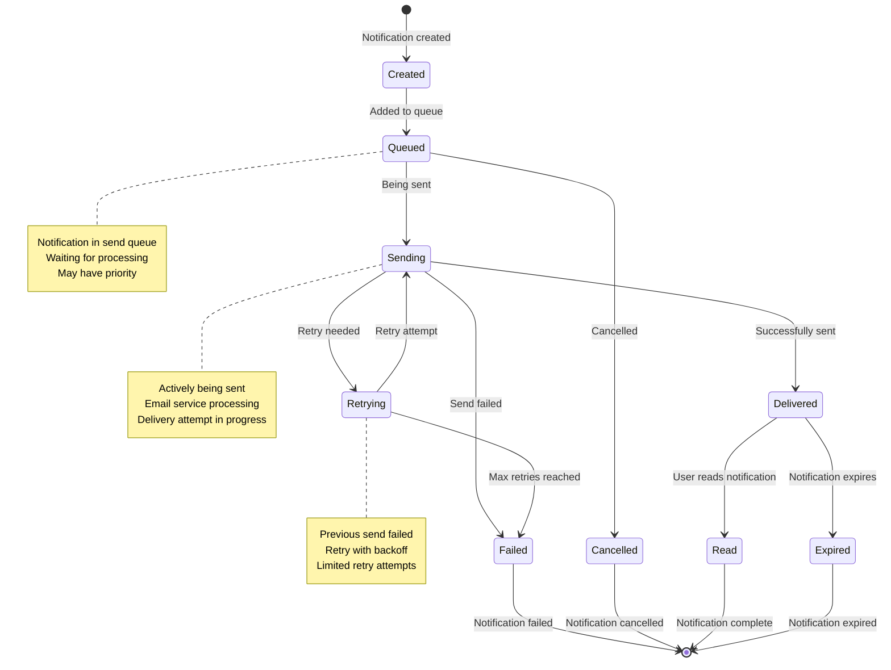

# State Diagram - CandiHire System

## Overview
State diagrams show the different states of objects in the CandiHire system and the transitions between them.

## 1. User Account State Diagram

## 2. Job Application State Diagram

## 3. Exam State Diagram

## 4. Interview State Diagram

## 5. System Maintenance State Diagram

## 6. Admin Session State Diagram

## 7. File Upload State Diagram

## 8. Notification State Diagram

## State Transition Rules

### User Account States
- **Registration**: Unregistered → PendingVerification
- **Verification**: PendingVerification → Active (success) or Unregistered (expired)
- **Suspension**: Active → Suspended (admin action)
- **Deactivation**: Active → Inactive (user action)
- **Deletion**: Any state → Deleted (admin action)

### Job Application States
- **Submission**: Draft → Submitted
- **Review**: Submitted → UnderReview
- **Decision**: UnderReview → Shortlisted/Rejected/InterviewScheduled
- **Interview**: InterviewScheduled → InterviewCompleted
- **Offer**: InterviewCompleted → OfferMade
- **Acceptance**: OfferMade → Accepted → Hired

### Exam States
- **Assignment**: NotAssigned → Assigned → Available
- **Taking**: Available → InProgress
- **Completion**: InProgress → Submitted/TimeExpired/Abandoned
- **Grading**: Submitted/TimeExpired → Graded
- **Result**: Graded → Passed/Failed

### Interview States
- **Scheduling**: Requested → Scheduled
- **Conducting**: Scheduled → InProgress
- **Completion**: InProgress → Completed
- **Feedback**: Completed → FeedbackSubmitted

## State Validation Rules

### Preconditions
- **User Registration**: Valid email, unique username
- **Job Application**: User authenticated, job exists, requirements met
- **Exam Taking**: User assigned, exam available, not expired
- **Interview Scheduling**: Both parties available, valid time slot

### Postconditions
- **State Changes**: Logged in audit trail
- **Notifications**: Sent to relevant parties
- **Data Updates**: Database updated atomically
- **Cleanup**: Temporary data removed

### Error Handling
- **Invalid Transitions**: Prevented by validation
- **Concurrent Updates**: Handled with locking
- **System Failures**: Rollback to previous state
- **Timeout Handling**: Automatic state transitions
