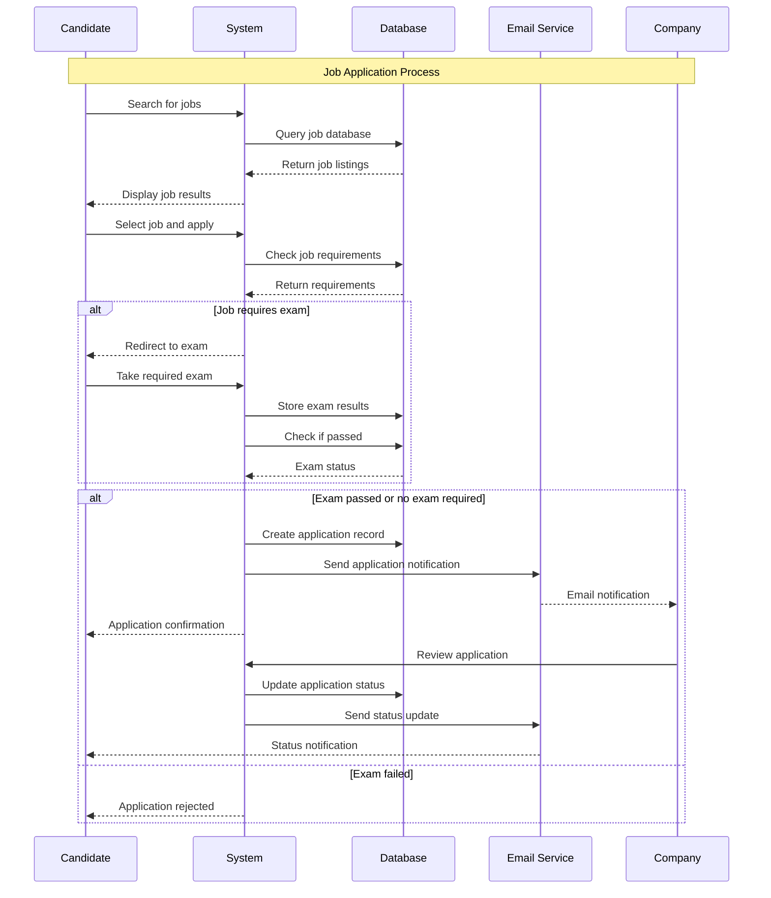
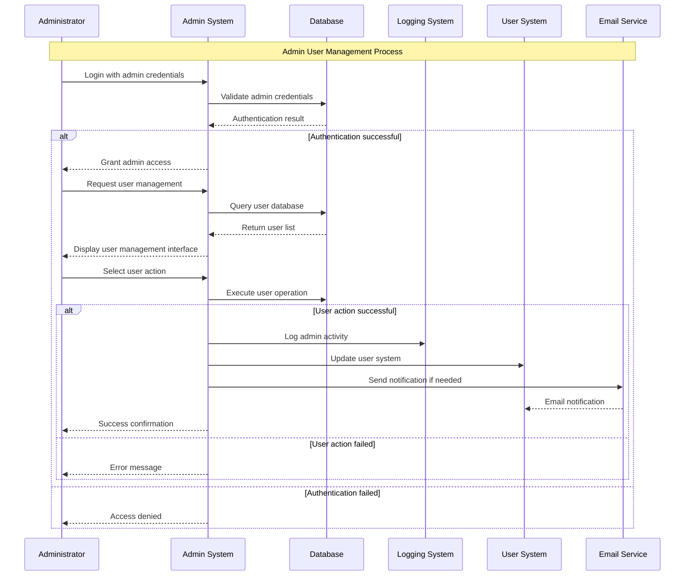
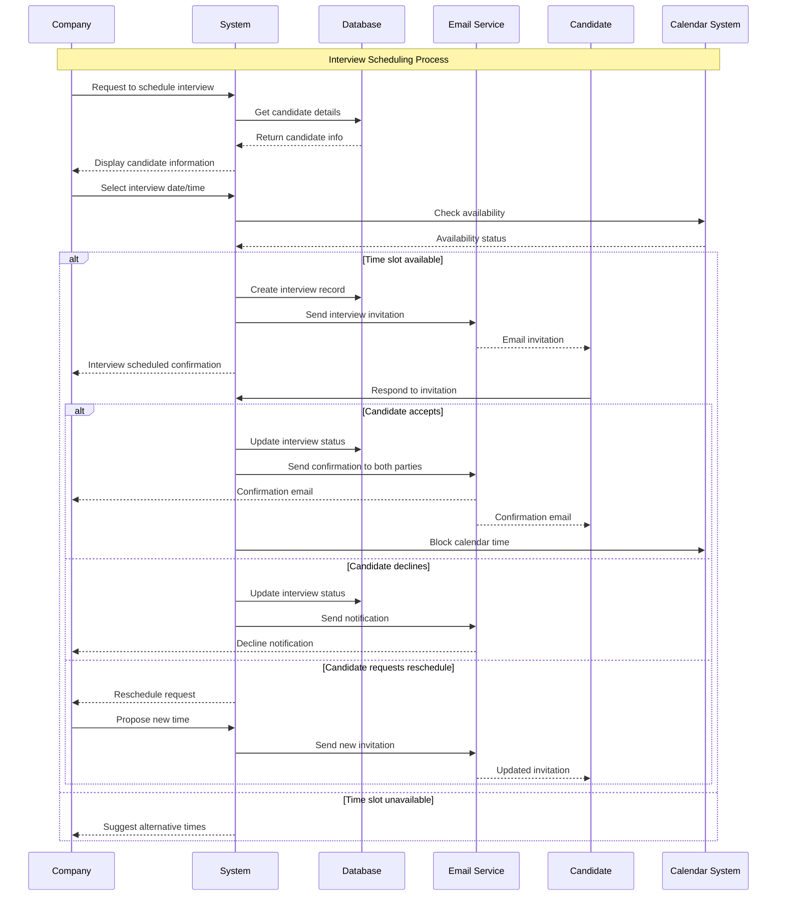
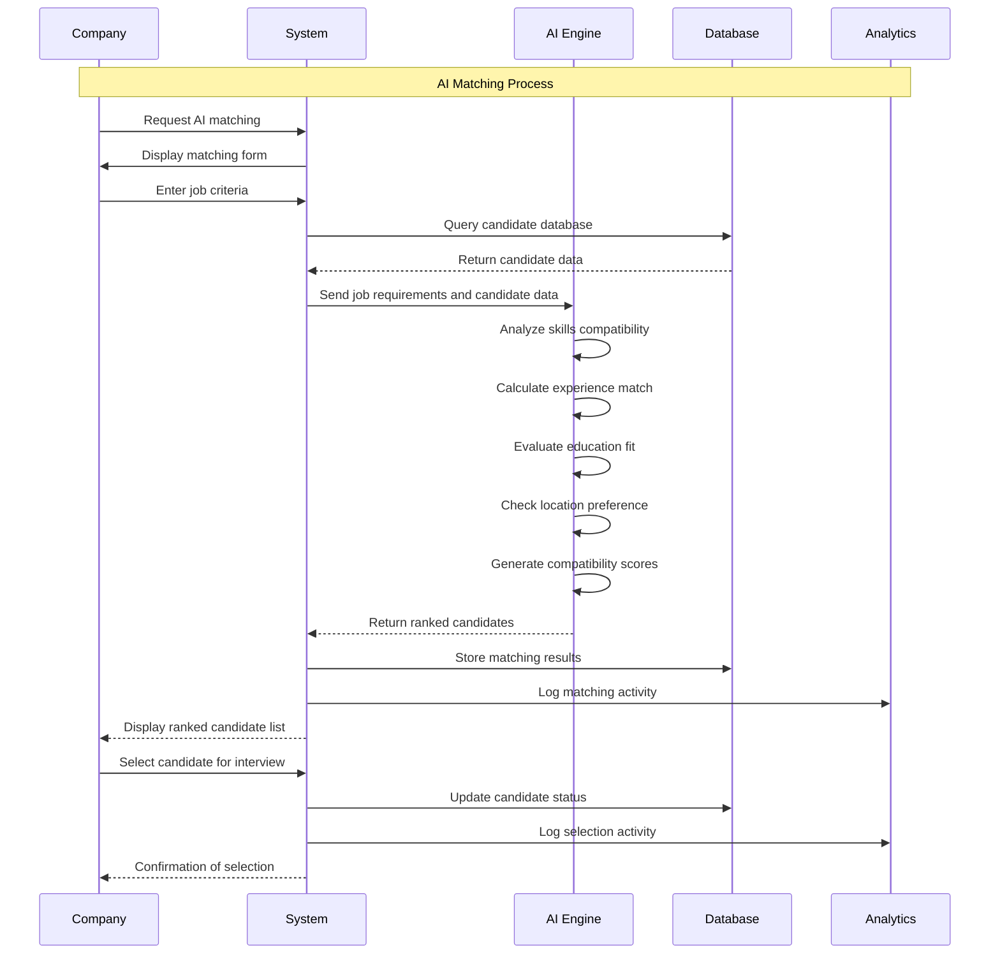
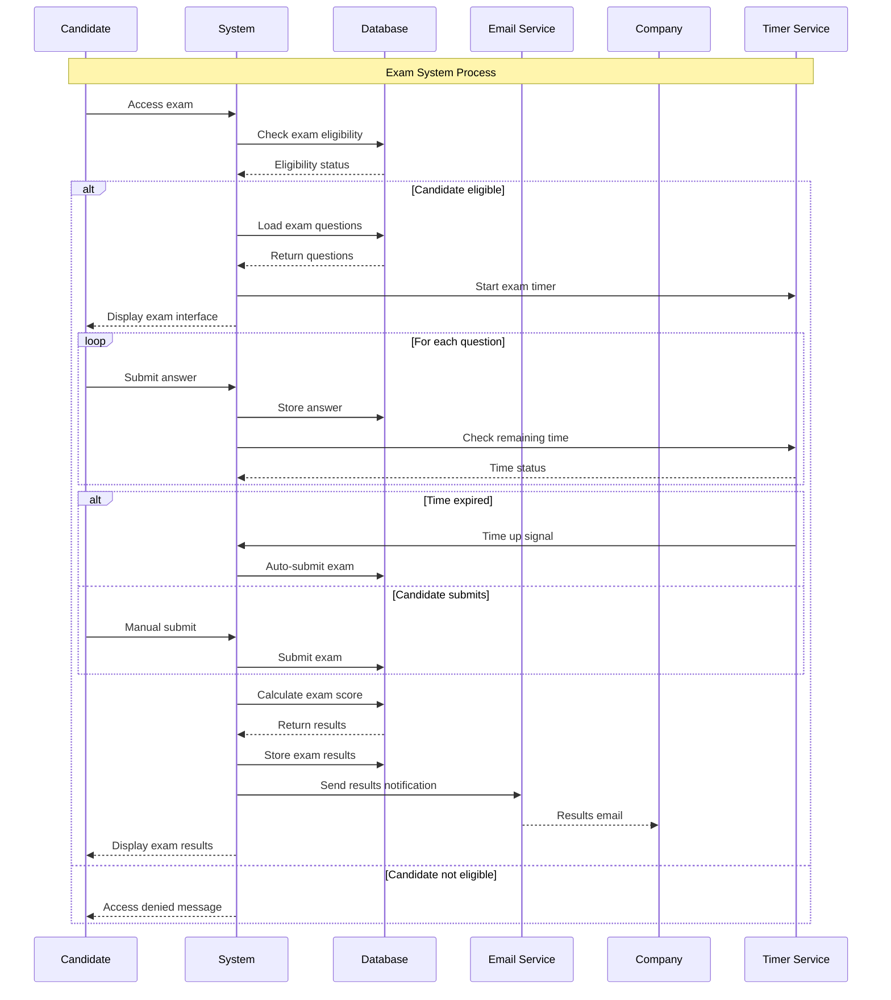
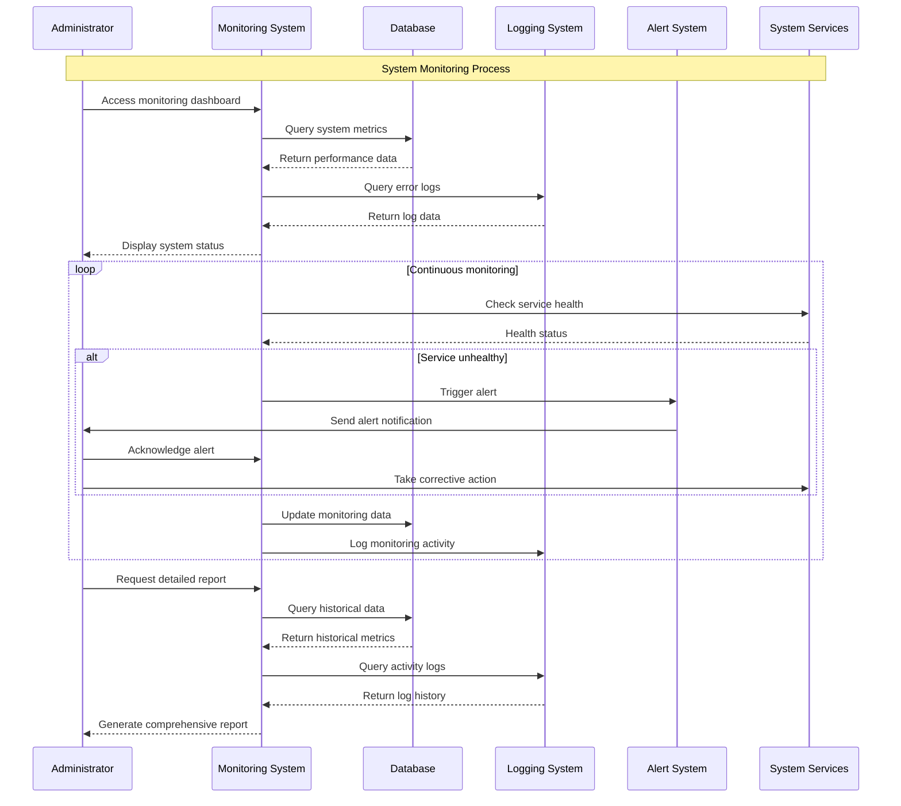
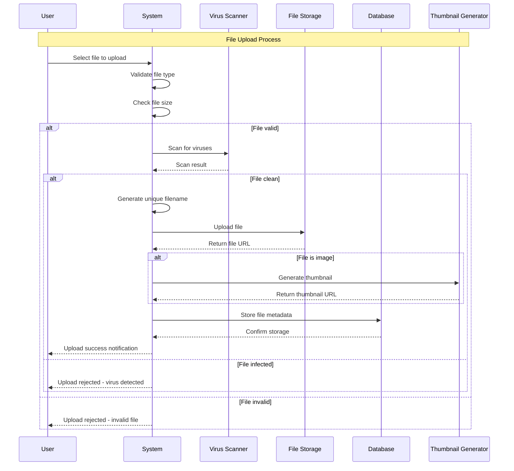
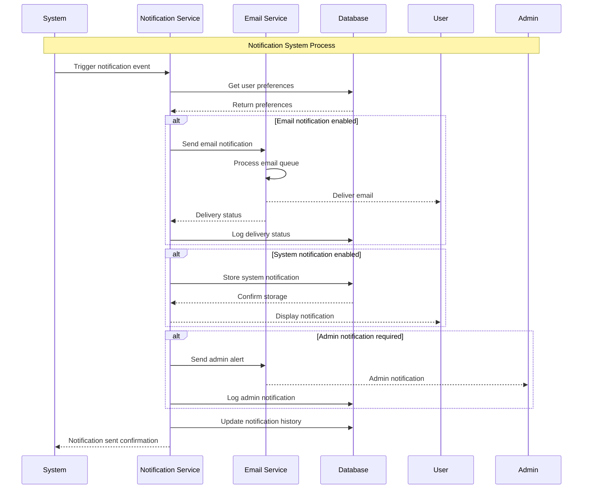

# Swimlane Diagram - CandiHire System

## Overview
Swimlane diagrams show the interaction between different actors (swimlanes) in the CandiHire system processes.

## 1. Job Application Process Swimlane

## 2. Admin User Management Swimlane

## 3. Interview Scheduling Swimlane

## 4. AI Matching Process Swimlane

## 5. Exam System Swimlane

## 6. System Monitoring Swimlane

## 7. File Upload Process Swimlane

## 8. Notification System Swimlane

## Swimlane Descriptions

### Candidate Swimlane
- **Responsibilities**: User interactions, form submissions, exam taking
- **Key Activities**: Job searching, application submission, exam participation
- **Decision Points**: Job selection, exam answers, interview responses

### Company Swimlane
- **Responsibilities**: Job posting, candidate review, interview scheduling
- **Key Activities**: Job management, application review, candidate selection
- **Decision Points**: Job requirements, candidate selection, interview scheduling

### Administrator Swimlane
- **Responsibilities**: System management, user oversight, configuration
- **Key Activities**: User management, system monitoring, settings configuration
- **Decision Points**: User actions, system responses, maintenance scheduling

### System Swimlane
- **Responsibilities**: Data processing, business logic, integration
- **Key Activities**: Data validation, processing, storage, retrieval
- **Decision Points**: Data validation, process routing, error handling

### Database Swimlane
- **Responsibilities**: Data persistence, query processing, data integrity
- **Key Activities**: Data storage, retrieval, updates, transactions
- **Decision Points**: Query optimization, transaction management

### Email Service Swimlane
- **Responsibilities**: Email delivery, notification management
- **Key Activities**: Email processing, delivery tracking, bounce handling
- **Decision Points**: Delivery routing, retry logic, failure handling

### AI Engine Swimlane
- **Responsibilities**: Machine learning, pattern recognition, scoring
- **Key Activities**: Data analysis, algorithm processing, result generation
- **Decision Points**: Algorithm selection, scoring thresholds, result ranking

## Synchronization Points

### Critical Synchronization
- **Exam Submission**: Timer and submission must be synchronized
- **Interview Confirmation**: Both parties must confirm
- **File Upload**: Upload and metadata storage must be atomic
- **User Management**: Admin actions must be logged and applied atomically

### Asynchronous Operations
- **Email Delivery**: Can be processed asynchronously
- **File Processing**: Thumbnail generation can be background
- **Analytics**: Data analysis can be scheduled
- **Notifications**: Can be queued and processed later

### Error Handling
- **Transaction Rollback**: Database operations must be reversible
- **Retry Logic**: Failed operations should be retried
- **Fallback Mechanisms**: Alternative paths for critical operations
- **Audit Trails**: All operations must be logged for debugging
