# Use Case Diagram - CandiHire System

## Overview
The Use Case Diagram illustrates the interactions between different actors and the CandiHire system, including the admin functionality.

## Diagram Code (Mermaid)

```mermaid
graph TB
    %% Actors
    Candidate[👤 Candidate]
    Company[🏢 Company]
    Admin[👨‍💼 Administrator]
    System[🤖 System]
    
    %% Use Cases - Candidate
    subgraph "Candidate Use Cases"
        UC1[Register Account]
        UC2[Login/Logout]
        UC3[Create Profile]
        UC4[Upload CV]
        UC5[Search Jobs]
        UC6[Apply for Job]
        UC7[Take Exam]
        UC8[View Exam Results]
        UC9[Schedule Interview]
        UC10[Update Profile]
        UC11[View Applications]
        UC12[Build CV]
        UC13[Check CV]
    end
    
    %% Use Cases - Company
    subgraph "Company Use Cases"
        UC14[Register Company]
        UC15[Login/Logout]
        UC16[Create Company Profile]
        UC17[Post Job]
        UC18[View Applications]
        UC19[Review Candidates]
        UC20[Schedule Interview]
        UC21[Use AI Matching]
        UC22[View MCQ Results]
        UC23[Manage Job Posts]
        UC24[Create Exam]
        UC25[Assign Exam]
        UC26[Upload Company Logo]
    end
    
    %% Use Cases - Admin
    subgraph "Admin Use Cases"
        UC27[Admin Login]
        UC28[View Dashboard]
        UC29[Manage Users]
        UC30[Manage Companies]
        UC31[View System Stats]
        UC32[Monitor Activity]
        UC33[Configure Settings]
        UC34[Export Data]
        UC35[Bulk Operations]
        UC36[View Logs]
        UC37[Toggle User Status]
        UC38[Delete Users]
        UC39[System Maintenance]
    end
    
    %% Use Cases - System
    subgraph "System Use Cases"
        UC40[Send Notifications]
        UC41[Process Payments]
        UC42[Generate Reports]
        UC43[Backup Data]
        UC44[Validate Data]
        UC45[AI Matching Algorithm]
        UC46[Email Processing]
        UC47[File Processing]
        UC48[Security Monitoring]
    end
    
    %% Actor-Use Case Relationships
    Candidate --> UC1
    Candidate --> UC2
    Candidate --> UC3
    Candidate --> UC4
    Candidate --> UC5
    Candidate --> UC6
    Candidate --> UC7
    Candidate --> UC8
    Candidate --> UC9
    Candidate --> UC10
    Candidate --> UC11
    Candidate --> UC12
    Candidate --> UC13
    
    Company --> UC14
    Company --> UC15
    Company --> UC16
    Company --> UC17
    Company --> UC18
    Company --> UC19
    Company --> UC20
    Company --> UC21
    Company --> UC22
    Company --> UC23
    Company --> UC24
    Company --> UC25
    Company --> UC26
    
    Admin --> UC27
    Admin --> UC28
    Admin --> UC29
    Admin --> UC30
    Admin --> UC31
    Admin --> UC32
    Admin --> UC33
    Admin --> UC34
    Admin --> UC35
    Admin --> UC36
    Admin --> UC37
    Admin --> UC38
    Admin --> UC39
    
    System --> UC40
    System --> UC41
    System --> UC42
    System --> UC43
    System --> UC44
    System --> UC45
    System --> UC46
    System --> UC47
    System --> UC48
    
    %% Include/Extend Relationships
    UC6 -.->|includes| UC7
    UC17 -.->|includes| UC24
    UC20 -.->|includes| UC40
    UC21 -.->|includes| UC45
    UC27 -.->|includes| UC28
    UC29 -.->|includes| UC37
    UC29 -.->|includes| UC38
    UC35 -.->|includes| UC29
    UC35 -.->|includes| UC30
```

## Detailed Use Case Descriptions

### Candidate Use Cases

#### UC1: Register Account
- **Actor**: Candidate
- **Description**: New user creates an account with email and password
- **Preconditions**: User has valid email address
- **Main Flow**:
  1. User clicks "Register"
  2. System displays registration form
  3. User enters personal details
  4. System validates information
  5. System creates account
  6. System sends confirmation email
- **Postconditions**: User account created and activated

#### UC2: Login/Logout
- **Actor**: Candidate, Company, Admin
- **Description**: User authenticates to access the system
- **Main Flow**:
  1. User enters credentials
  2. System validates credentials
  3. System creates session
  4. User accesses dashboard
- **Alternative Flow**: Invalid credentials - show error message

#### UC5: Search Jobs
- **Actor**: Candidate
- **Description**: Candidate searches for job opportunities
- **Main Flow**:
  1. Candidate enters search criteria
  2. System queries job database
  3. System displays matching jobs
  4. Candidate can filter and sort results

#### UC7: Take Exam
- **Actor**: Candidate
- **Description**: Candidate takes online assessment
- **Main Flow**:
  1. Candidate selects exam
  2. System displays questions
  3. Candidate answers questions
  4. System calculates score
  5. System stores results

### Company Use Cases

#### UC17: Post Job
- **Actor**: Company
- **Description**: Company creates new job posting
- **Main Flow**:
  1. Company fills job details form
  2. System validates information
  3. System publishes job posting
  4. System notifies relevant candidates

#### UC21: Use AI Matching
- **Actor**: Company
- **Description**: Company uses AI to find matching candidates
- **Main Flow**:
  1. Company enters job requirements
  2. System analyzes candidate profiles
  3. System returns ranked candidates
  4. Company reviews matches

### Admin Use Cases

#### UC27: Admin Login
- **Actor**: Administrator
- **Description**: Admin authenticates with special credentials
- **Main Flow**:
  1. Admin clicks "Admin Login"
  2. System displays admin login form
  3. Admin enters admin credentials
  4. System validates admin credentials
  5. System grants admin access

#### UC28: View Dashboard
- **Actor**: Administrator
- **Description**: Admin views system overview and statistics
- **Main Flow**:
  1. Admin accesses dashboard
  2. System displays key metrics
  3. System shows recent activity
  4. Admin can navigate to detailed views

#### UC29: Manage Users
- **Actor**: Administrator
- **Description**: Admin manages candidate and company accounts
- **Main Flow**:
  1. Admin selects user management
  2. System displays user list
  3. Admin can view, edit, activate/deactivate users
  4. Admin can delete users
  5. System logs all admin actions

#### UC33: Configure Settings
- **Actor**: Administrator
- **Description**: Admin modifies system-wide settings
- **Main Flow**:
  1. Admin accesses settings panel
  2. System displays current settings
  3. Admin modifies values
  4. System saves changes
  5. System applies new settings

### System Use Cases

#### UC40: Send Notifications
- **Actor**: System
- **Description**: System sends automated notifications
- **Triggers**: User actions, scheduled events
- **Main Flow**:
  1. System identifies notification need
  2. System prepares message
  3. System sends via email
  4. System logs delivery status

#### UC45: AI Matching Algorithm
- **Actor**: System
- **Description**: System matches candidates to jobs using AI
- **Main Flow**:
  1. System receives job requirements
  2. System analyzes candidate profiles
  3. System calculates compatibility scores
  4. System ranks candidates
  5. System returns results

## Use Case Relationships

### Include Relationships
- **UC6 (Apply for Job) includes UC7 (Take Exam)**: Job applications may require exam completion
- **UC17 (Post Job) includes UC24 (Create Exam)**: Job postings may include exam creation
- **UC20 (Schedule Interview) includes UC40 (Send Notifications)**: Interview scheduling sends notifications
- **UC21 (Use AI Matching) includes UC45 (AI Matching Algorithm)**: AI matching uses the algorithm
- **UC27 (Admin Login) includes UC28 (View Dashboard)**: Admin login leads to dashboard
- **UC29 (Manage Users) includes UC37 (Toggle User Status)**: User management includes status changes
- **UC35 (Bulk Operations) includes UC29 (Manage Users)**: Bulk operations include user management

### Extend Relationships
- **UC40 (Send Notifications) extends UC20 (Schedule Interview)**: Notifications extend interview scheduling
- **UC42 (Generate Reports) extends UC28 (View Dashboard)**: Reports extend dashboard functionality

## Actor Characteristics

### Candidate
- **Primary Goal**: Find suitable employment
- **Technical Skill**: Basic to intermediate
- **Access Level**: Limited to own data and public job postings

### Company
- **Primary Goal**: Find qualified candidates
- **Technical Skill**: Intermediate to advanced
- **Access Level**: Own company data and candidate profiles

### Administrator
- **Primary Goal**: Maintain system integrity and performance
- **Technical Skill**: Advanced
- **Access Level**: Full system access with audit logging

### System
- **Primary Goal**: Automate processes and maintain data integrity
- **Characteristics**: Automated, reliable, secure
- **Access Level**: All system resources
